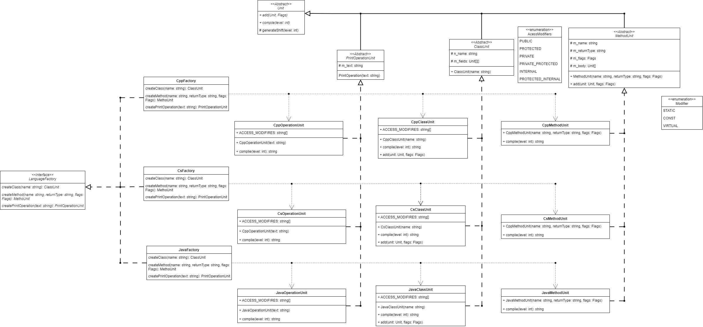
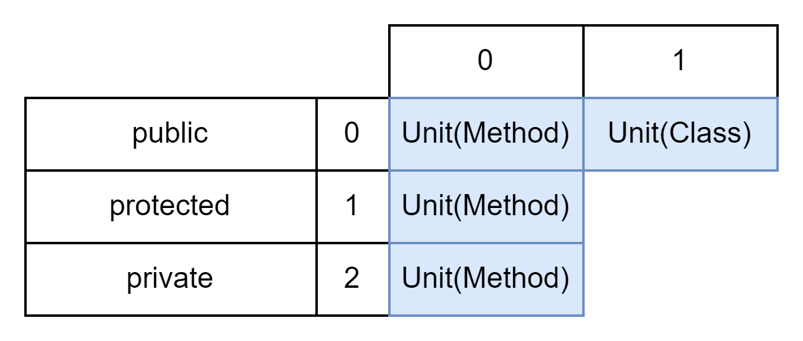

## Постановка задачи
Имеется код для генерации классов на языке C++. Необходимо расширить реализацию для генерации ОО классов для нескольких языков(C#, Java):
    - с учетом различных модификаторов доступа и методов конкретного языка
    - требуется использовать паттерн "Абстрактная фабрика" для решения данной задачи

## Предлагаемое решение
Создать абстрактный уровень, который будет определять **общие интерфейсы** для генерации кода. Реализовать конкретные классы для каждого языка, которые будут наследовать общий интерфейс и реализовывать специфическую логику генерации кода. Или просто **использовать абстрактную фабрику**.

Общие интерфейсы генерации кода:
- `ClassUnit` (генерация исходного кода класса)
- `MethodUnit` (генерация исходного кода метода)
- `PrintOperationUnit` (генерация оператора вывода в консоль)

Данные интерфейсы наследуются от интерфейса **Unit** в котором определены методы для:
- добавления вложенности `Unit::add [virtual]`
- генерации кода `Unit::compile [pure virtual]`
- генерации отступов `Unit::generateShift`


Семейство классов **С++**:
- `CppClassUnit` implement `ClassUnit`
- `CppMethodUnit` implement `MethodUnit`
- `CppOperationUnit` implement `PrintOperationUnit`

Аналогично для **Java** и **C#**.

`LanguageFactory` - интерфейс для создания семейств объектов. Реализующие данный интерфейс конкретные фабрики:
- `CppFactory` определяет процесс создания семейства **C++**
- `CsFactory` определяет процесс создания семейства **C#**
- `JavaFactory` определяет процесс создания семейства **Java**

Архитектура


### ClassUnit::AccessModifier (enum)
Флаги модификаторов доступа метода/свойства класса

### Cpp/Cs/JavaClassUnit::ACCESS_MODIFIERS (static string\[\])
Определяет строковое представление модификаторов доступа, индексы должны совпадать с соответствующим перечислением `ClassUnit::AccessModifier`. Пример:
```
const std::vector<std::string> CppClassUnit::ACCESS_MODIFIERS = { "public", "protected", "private" };
```


> [!warning]
> Данное поле должны содержать все наследники `ClassUnit` (CppClassUnit, JavaClassUnit, CsClassUnit)


### ClassUnit::m_fields (Unit\[\]\[\])
Двумерный динамический массив в котором находятся все поля и методы(Unit-ы) данного класса. i-я строка содержит Unit-ы с модификатором доступа `ACCESS_MODIFIERS[static_cast<ClassUnit::AccessModifier>(i)]`


### MethodUnit::m_body (Unit\[\])
Массив Unit-в которые будут находится в теле данного метода

